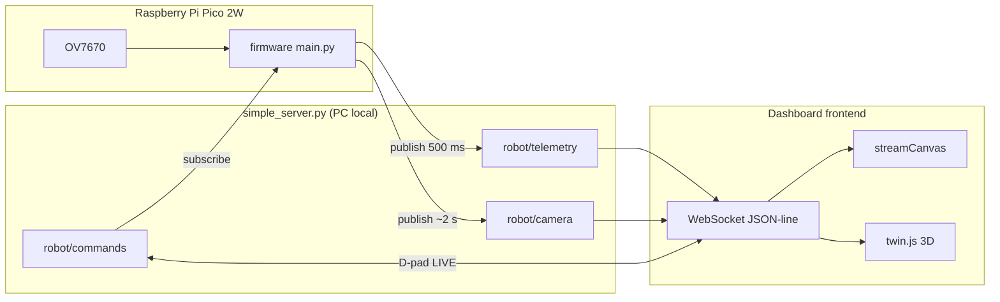

# Montaje y cableado · SISEMB (Pico 2W)

> **PCB nueva / pinout definitivo:** ver **[PINOUT_PCB.md](PINOUT_PCB.md)** (L298N 4 IN, MeArm, OLED, ultrasonido, batería; cámara **ESP32-CAM** por Wi‑Fi, sin OV7670 en la Pico).

Guía para conectar **batería (ADC)**, **HC-SR04**, **L298N**, **OLED I2C SSD1306**, **servos MeArm** y control por **simpleBroker/dashboard**. La OV7670 en la Pico queda como referencia histórica; el diseño actual usa **ESP32-CAM** externa.

> El sensor es **HC-SR04** (no HC-04). Va **fijo al frente** del chasis.
> **Receptor IR y LCD 16×2 retirados** del cableado; control por dashboard/simpleBroker. **GP6 libre.**

---

## Pinout unificado · Raspberry Pi Pico 2W (SISEMB v2)

Tabla única de conexiones. Fuente de verdad en firmware: `firmware/hardware_pins.py`.

| GPIO | Pin físico (header) | Módulo | Señal / función | Dir. | Notas |
|------|---------------------|--------|-----------------|------|--------|
| **GP0** | 1 | OV7670 | D0 | IN | Bus paralelo 8 bits (D0–D7) |
| **GP1** | 2 | OV7670 | D1 | IN | |
| **GP2** | 4 | HC-SR04 | Trig | OUT | Pulso disparo (~10 µs) |
| **GP3** | 5 | HC-SR04 | Echo | IN | **Divisor 5 V → 3.3 V obligatorio** |
| **GP4** | 6 | I2C | SDA | I/O | OLED **0x3C** + OV7670 SCCB **0x21** (bus compartido) |
| **GP5** | 7 | I2C | SCL | OUT | Pull-ups en módulos I2C |
| **GP6** | 9 | L298N | ENA | OUT | PWM velocidad motor izquierdo (OUT1/2) |
| **GP7** | 10 | OV7670 | D2 | IN | |
| **GP8** | 11 | OV7670 | D3 | IN | |
| **GP9** | 12 | OV7670 | D4 | IN | |
| **GP10** | 14 | OV7670 | D5 | IN | |
| **GP11** | 15 | OV7670 | D6 | IN | |
| **GP12** | 16 | OV7670 | D7 | IN | |
| **GP13** | 17 | OV7670 | VSYNC | IN | Sincronismo vertical |
| **GP14** | 19 | L298N | IN1 | OUT | Dirección motor (modo tanque) |
| **GP15** | 20 | L298N | IN2 | OUT | Dirección motor (modo tanque) |
| **GP16** | 21 | L298N | ENB | OUT | PWM velocidad motor derecho (OUT3/4); `CAM_RESET_PIN = None` |
| **GP17** | 22 | MeArm | Servo base | OUT | PWM señal; alimentación servo **externa 5–6 V** |
| **GP18** | 24 | MeArm | Servo hombro (shoulder) | OUT | PWM señal |
| **GP19** | 25 | OV7670 | PWDN | OUT | **LOW** = cámara encendida (`CAM_PWDN_PIN`) |
| **GP20** | 26 | MeArm | Servo codo (elbow) | OUT | PWM señal |
| **GP21** | 27 | MeArm | Servo pinza (gripper) | OUT | PWM señal |
| **GP22** | 29 | OV7670 | XCLK | OUT | Reloj ~12 MHz (PWM firmware) |
| GP23 | — | — | — | — | No expuesto en header de 40 pines (Pico 2W) |
| GP24 | — | — | — | — | No expuesto en header de 40 pines (Pico 2W) |
| GP25 | 30 | (on-board) | LED Wi-Fi | — | LED integrado CYW43; no usado por SISEMB |
| **GP26** | 31 | Batería | ADC0 (VSENSE) | IN | Solo **0–3.3 V**; divisor de tensión obligatorio |
| **GP27** | 32 | OV7670 | HREF | IN | Línea activa de fila |
| **GP28** | 34 | OV7670 | PCLK | IN | Reloj de pixel |

### Alimentación y masa (común a todos los módulos)

| Pin Pico | Conexión |
|----------|----------|
| **3V3 (OUT)** | OV7670 (si módulo 3.3 V), OLED, lógica HC-SR04 Trig |
| **GND** | GND común: OV7670, HC-SR04, L298N, OLED, MeArm (referencia), divisor batería |
| **VSYS / VBUS** | Según tu fuente; motores y servos por **fuente externa** (no desde 3V3 de la Pico) |

### L298N · modo tanque (2 GPIO) — módulo grande

| Terminal / pin L298N | Qué conectar | Notas |
|----------------------|--------------|--------|
| **VIN / +12V** (rojo) | **Alimentación de MOTORES** (7–12 V típico, 2S LiPo ~8.4 V) | **No** es la entrada de 5 V lógica. Es la potencia del puente H. |
| **GND** (azul) | **GND común** (Pico, batería motores, batería lógica) | Obligatorio unir todas las masas. |
| **+5V / 5V lógico** (verde) | Ver jumper abajo | Lógica interna del L298N (IN/ENA), no alimenta los motores. |
| **OUT1 / OUT2** | Motor izquierdo | |
| **OUT3 / OUT4** | Motor derecho | |
| **IN1** | **GP14** (Pico) | Dirección |
| **IN2** | **GP15** (Pico) | Dirección |
| **IN3** | **Puente a IN1** en el PCB del módulo | Misma dirección que canal A |
| **IN4** | **Puente a IN2** en el PCB del módulo | Misma dirección que canal A |
| **ENA** | **GP6** (Pico) | PWM rueda izquierda — **quita jumper ENA** del módulo |
| **ENB** | **GP16** (Pico) | PWM rueda derecha — **quita jumper ENB** del módulo |

#### Jumper del regulador 5 V (detrás del borne de potencia)

| Jumper | VIN (motor) | Pin +5V del módulo |
|--------|-------------|---------------------|
| **Puesto (ON)** | 6–12 V en VIN | **Salida** ~5 V (regulador interno). Puede alimentar lógica del L298N; **no** uses esa salida para alimentar la Pico 2W (usa USB o 5 V estable aparte). |
| **Quitado (OFF)** | >12 V en VIN o si no quieres el regulador | **Entrada**: debes inyectar **5 V externos** en el pin +5V para la lógica del L298N. |

**Resumen:** **no pongas solo 5 V en VIN** salvo motores muy pequeños de 5 V y corriente baja. VIN = voltaje del pack de motores; la Pico solo lleva señales **3.3 V** en IN1/IN2 (la mayoría de L298N aceptan HIGH ≥2.5 V).

> Giros LEFT/RIGHT: misma dirección en IN1/IN2, pero **ENA más bajo que ENB** (o al revés). No uses giro “rueda atrás / rueda adelante”.

### GPIO libres

| GPIO | Estado |
|------|--------|
| **GP6** | Libre (antes IR) |
| GP23/GP24 | No expuestos en header 40 pines |
| GP25 | LED Wi-Fi onboard |

---

## Flujo simpleBroker / WebSocket (cámara + telemetría)

El dashboard no habla con la Pico por USB: todo pasa por broker de red. En runtime actual, la Pico usa simpleBroker por socket TCP (JSON-line con `action: PUB/SUB`) y el navegador mantiene compatibilidad consumiendo/publicando los mismos topicos (`robot/telemetry`, `robot/camera`, `robot/commands`) por WebSocket.



| Topic | Dirección | Contenido |
|-------|-----------|-----------|
| `robot/telemetry` | Pico → todos | JSON: batería, drive, ultrasonido, vision, MeArm |
| `robot/commands` | Dashboard → Pico | Drive: `{"cmd":"FWD","l_pwm":70,"r_pwm":70}` · MeArm: ver abajo |
| `robot/camera` | Pico → todos | Frame thumbnail base64 (ver abajo) |

> Nota de migracion: el transporte cambió a simpleBroker, pero estos contratos de topico/payload se mantienen.

**Límite de tamaño:** con broker local simpleBroker, conviene mantener frames **< 20 KB** para baja latencia (thumbnail 80×60 RGB565 base64 ≈ 11 KB).

### Formato `robot/camera`

```json
{
  "format": "rgb565",
  "width": 80,
  "height": 60,
  "data": "<base64>",
  "ts": 123456,
  "source": "ov7670"
}
```

Cuando exista encoder JPEG en firmware, `format` será `"jpeg"` con las mismas claves.

### Detección de color (umbrales RGB)

El análisis replica la idea de `cv2.inRange` sobre RGB (sin OpenCV en el navegador):

| Capa | Módulo | Entrada |
|------|--------|---------|
| Dashboard | `frontend/vision_color.js` | Cada mensaje `robot/camera` (thumbnail 80×60 rgb565 base64) |
| Pico (telemetría) | `firmware/color_analysis.py` | Mismo thumbnail derivado del último frame OV7670 |

**Colores y umbrales:** RED, ORANGE, YELLOW, GREEN, CYAN, BLUE, MAGENTA, WHITE, BLACK — cada uno con `rgbMin`/`rgbMax` por canal. Cada píxel se asigna al color con mejor ajuste al centro del rango (clasificación exclusiva; los porcentajes suman ~100 % en el top 4).

**Salida `vision` (telemetría y UI):**

- `analysis[]`: hasta 4 colores ordenados por `pct`
- `dominant_color`: mayor porcentaje
- `target_coords`: centroide del color dominante escalado a 320×240
- `target_detected`: `true` si el dominante ≥ 8 % y no es BLACK

Con frames de cámara recientes (&lt; 4 s), el dashboard **prioriza** el análisis calculado en el cliente sobre el campo `vision` de `robot/telemetry` (el firmware sigue publicando vision real cuando hay frame).

---

## OV7670 · cableado

Módulo paralelo estándar (captura por polling en firmware; QQVGA).

| Señal OV7670 | Pico GPIO |
|--------------|-----------|
| D0–D7 | GP0, GP1, GP7–GP12 |
| VSYNC | GP13 |
| HREF | GP27 |
| PCLK | GP28 |
| XCLK | GP22 (PWM ~8 MHz) |
| SIOD / SIOC | GP4 / GP5 (I2C con OLED) |
| **RESET (RST)** | **GP16** |
| **PWDN** | **GP19** (LOW = encendida) |
| VCC / GND | 3.3 V y **GND común** con Pico |

### RST y PWDN por GPIO (recomendado)

| Pin OV7670 | GPIO | Comportamiento firmware |
|------------|------|-------------------------|
| **RESET** | GP16 | Pulso bajo-alto al iniciar |
| **PWDN** | GP19 | Salida LOW permanente (cámara activa) |

Si no cableas GP16/GP19, deja `CAM_RESET_PIN = None` y `CAM_PWDN_PIN = None` en `config.py` y usa pull-up 10 kΩ en RST + PWDN a GND (modo anterior). **No dejes RST/PWDN flotantes.**

**Notas:**

- SCCB comparte bus con OLED; dirección cámara **0x21** (a veces **0x60**).
- Tras init correcto verás `[ov7670] PID=0x76` y `COM17=0x00` (sin color bar).
- Si el dashboard muestra **franjas de colores** (barras verticales + degradados), la OV7670 está en **modo test** — sube el `ov7670.py` actualizado y reinicia (`hardware_init` o Run).
- `CAMERA_PUBLISH_STUB = True` publica patrón si I2C falla (útil para probar dashboard).
- FPS recomendado: **1–2 fps** (`CAMERA_PUBLISH_INTERVAL_MS = 5000`).

### Configuración firmware

En `firmware/config.py` (copiar claves desde `config.example.py`):

```python
CAMERA_ENABLED = True
CAMERA_FORCE_STUB = False
CAMERA_PUBLISH_STUB = True   # False cuando PID=0x76 y captura real OK
CAM_RESET_PIN = 16
CAM_PWDN_PIN = 19
MQTT_TOPIC_CAMERA = b"robot/camera"
CAMERA_PUBLISH_INTERVAL_MS = 5000
```

---

## Control de conducción (simpleBroker)

| Origen | Acción |
|--------|--------|
| `robot/commands` | FWD / REV / LEFT / RIGHT / STOP → motores (dashboard LIVE) |
| Telemetría | `robot/telemetry` cada 500 ms |

**Prioridad:** el **último comando aplicado gana**. `STOP` / `STOP_EMERGENCIA` detiene motores al instante.

En **modo tanque** (IN3/IN4 puenteados), LEFT/RIGHT no hacen giro diferencial real; el firmware aplica variación de PWM limitada. Para 2WD con giro real, cablea IN3/IN4 a GPIO libres y reasigna MeArm (ver comentarios en `hardware_pins.py`).

### Gemelo digital (dashboard)

El chasis 3D en `frontend/twin.js` **solo se mueve** con telemetría real de `drive`. El brazo MeArm en el gemelo **solo** sigue `mearm.servos` de la telemetría (sin animación simulada).

### Comandos MeArm (`robot/commands`)

```json
{"cmd":"GRIPPER_OPEN"}
{"cmd":"GRIPPER_CLOSE"}
{"cmd":"HOME_POSITION"}
{"mearm":{"joint":"base","angle":90}}
{"mearm":{"joint":"shoulder","delta":5}}
{"mearm":{"servos":{"base":90,"shoulder":70,"elbow":110,"gripper":50}}}
```

| Comando dashboard | Acción MeArm / sistema |
|--------------|------------------------|
| `GRIPPER_OPEN` / `GRIPPER_CLOSE` | Pinza |
| `HOME_POSITION` | Posición home |
| `{"mearm":{...}}` | Ángulos por articulación |
| FWD/REV/LEFT/RIGHT/STOP | Motores L298N |

---

## 1. Batería → ADC

### Divisor (2S LiPo ~8.4 V)

```
  +Batería ----[ R1 22 kΩ ]----+---- GP26 (ADC0)
                               |
                            [ R2 10 kΩ ]
                               |
                              GND
```

- `BATTERY_DIVIDER_RATIO = (R1+R2)/R2` en `config.py` (22 kΩ + 10 kΩ → **3.2**)
- `BATTERY_CALIB_SCALE`: multímetro en el pack ÷ voltaje que muestra firmware/OLED
- `BATTERY_V_MIN` / `BATTERY_V_MAX`: vacío y lleno del pack (2S: ~6.0–8.4 V)
- Los **mAh** (p. ej. 9600) indican capacidad; el **%** se calcula solo por voltaje

**Calibrar en REPL** (multímetro en bornes del pack):

```python
import battery, hardware_pins as p, config
battery.read_debug(p.BATTERY_ADC_PIN, config.BATTERY_DIVIDER_RATIO,
                   config.BATTERY_VREF, config.BATTERY_CALIB_SCALE)
# BATTERY_CALIB_SCALE = V_multimetro / v_pack impreso (con scale=1.0 primero)
```

Si lees **0 %** con ~5.3 V mostrados, suele ser `BATTERY_V_MIN` demasiado alto o el ratio/scale incorrectos.

---

## 2. HC-SR04 (ultrasonido frontal)

| HC-SR04 | Conexión |
|---------|----------|
| VCC | **5 V** |
| GND | GND Pico |
| Trig | **GP2** |
| Echo | **GP3** vía divisor 5 V→3.3 V |

---

## 3. L298N + 2 motores (modo tanque)

Módulo **sin pines ENA/ENB** expuestos: jumper del módulo en **5 V**.

| L298N | Pico / módulo |
|-------|----------------|
| IN1, IN2 | **GP14**, **GP15** |
| IN3, IN4 | **Puentear a IN1 e IN2** en el PCB del L298N |
| ENA, ENB | **No conectar** (o puente a 5 V en el módulo) |
| GND | **GND común** |

En `config.py`: `MOTOR_USE_PWM_ENABLE = False`, `MOTOR_TANK_PARALLEL = True`.

Si necesitas **giro diferencial real**, cablea IN3/IN4 a GPIO (p. ej. GP17/GP18) y pon `MOTOR_R_IN3` / `MOTOR_R_IN4` en `hardware_pins.py`; entonces reubica los servos MeArm que ocupen esos pines.

---

## 4. OLED SSD1306 128×64 (I2C)

Módulo típico **0.96"** con chip **SSD1306**, dirección **0x3C** (algunos usan **0x3D**).

| Pin OLED | Conexión |
|----------|----------|
| VCC | **3.3 V** (o 5 V si el módulo lo tolera; preferir 3.3 V) |
| GND | GND Pico |
| SDA | **GP4** (bus compartido) |
| SCL | **GP5** (bus compartido) |

En `config.py`:

```python
OLED_ENABLED = True
OLED_I2C_ADDR = 0x3C
OLED_WIDTH = 128
OLED_HEIGHT = 64
OLED_DRIVER = "ssd1306"   # o "sh1106" si ves ruido/tipo QR en vez de texto
OLED_COL_OFFSET = 0       # 2 automático si OLED_DRIVER = "sh1106"
```

Muestra texto ASCII (no iconos vectoriales): `SISEMB`, batería `Bxxx% x.xV`, barra, dirección `^ FWD`, ultrasonido `USxxx`, pinza `Gxxx` (`oled_display.py`).

**Pantalla con “ruido” o patrón tipo QR:** suele ser driver/direccionamiento incorrecto. Sube el `oled_display.py` nuevo y, si persiste, prueba `OLED_DRIVER = "sh1106"` en `config.py`.

---

## 5. Bus I2C compartido (GP4 / GP5)

| Dispositivo | Dirección 7-bit | Función |
|-------------|-----------------|----------|
| OLED SSD1306 | **0x3C** (o 0x3D) | Pantalla estado 128×64 |
| OV7670 SCCB | **0x21** | Config cámara |

Pull-ups en SDA/SCL (típico 4.7 kΩ en breadboard). **GND común** entre Pico, OLED y cámara.

### MeArm · servos directos por GPIO PWM

Ya no se usa PCA9685. Cada servo recibe señal desde la Pico; alimentación **externa 5–6 V** con **GND común**.

| Servo MeArm | Pico GPIO |
|-------------|-----------|
| Base (rotación) | **GP17** |
| Hombro (shoulder) | **GP18** |
| Codo (elbow) | **GP20** |
| Pinza (gripper) | **GP21** |

- Frecuencia PWM: **50 Hz**.
- Pulso: **500–2500 µs** ↔ 0–180° (`MEARM_SERVO_MIN_US` / `MEARM_SERVO_MAX_US`).

---

## Esquema general (GND común)

```
                    +------------------+
                    |  Raspberry Pi    |
                    |  Pico 2W         |
  Divisor bateria --+-- GP26           |
  HC-SR04       ----+-- GP2, GP3       |
  I2C OLED+CAM -----+-- GP4, GP5       |
  (GP6 libre)       |
  L298N         ----+-- GP14, GP15 (IN3/4 puenteados)
  MeArm servos  ----+-- GP17, GP18, GP20, GP21
  OV7670 par.   ----+-- GP0,1,7-13,27,28
  OV7670 XCLK   ----+-- GP22           |
  OV7670 RST/PD ----+-- GP16, GP19     |
                    |  GND ============+==== GND común
                    +------------------+
```

---

## Activar en firmware

1. `cp firmware/config.example.py firmware/config.py` y editar Wi-Fi + cámara.
2. `HARDWARE_ENABLED = True`, `CAMERA_ENABLED = True`.
3. Subir firmware:

```bash
./scripts/flash-sisemb.sh
```

4. Dashboard: conecta por WebSocket al broker local; telemetría + vídeo en `robot/camera`.

### Archivos firmware (cámara)

| Archivo | Rol |
|---------|-----|
| `hardware_pins.py` | Mapa GPIO unificado |
| `ov7670.py` | SCCB, XCLK, RST/PWDN, captura / stub |
| `camera_stream.py` | Thumbnail + JSON broker |
| `color_analysis.py` | Histograma rgb565 por umbrales RGB |
| `hardware.py` | Init I2C, OLED, MeArm PWM GPIO, cámara |
| `oled_display.py` | Pantalla SSD1306 128×64 |
| `mearm_controller.py` | 4 servos directos, dashboard |
| `motors_l298n.py` | L298N (modo tanque o diferencial) |
| `i2c_bus.py` | Bus I2C compartido |
| `main.py` | Publica `robot/camera` |
| `telemetry.py` | Vision desde último frame |

---

## Orden de pruebas

1. **Batería + OLED**
2. **Ultrasonido**
3. **Motores** (dashboard/simpleBroker) — FWD/REV/STOP
4. **Cámara**: REPL → `import robot_repl; robot_repl.hardware_init()` → `[ov7670] PID=0x76`
5. **LIVE** + panel Vision (`robot/camera`)

---

## Lista de materiales

| Pieza | Cantidad |
|-------|----------|
| Raspberry Pi Pico 2W | 1 |
| OV7670 (módulo paralelo) | 1 |
| HC-SR04 | 1 |
| Mini L298N | 1 |
| Motores DC 2WD | 2 |
| Receptor IR TSOP1838 | — *(retirado)* |
| OLED 0.96" SSD1306 I2C | 1 |
| LCD 16×2 I2C | — *(reemplazado por OLED)* |
| MeArm kit (4 servos) | 1 |
| Fuente externa 5–6 V para servos | 1 |
| Resistencias divisor (batería + echo) | varias |
| Cables dupont | varios |
