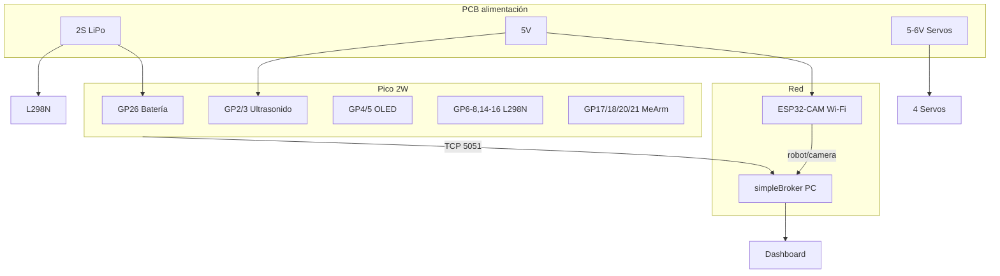

# Pinout definitivo · PCB SISEMB · Raspberry Pi Pico 2W

Diseño objetivo: **Pico 2W** como cerebro del robot; **ESP32-CAM** solo para vídeo (Wi‑Fi al broker, sin bus paralelo en la Pico).  
Sin OV7670 en la Pico. Sin PCA9685 (MeArm por PWM directo).

Fuente de verdad en firmware: `firmware/hardware_pins.py` + `firmware/config.py`.

---

## Resumen por bloque

| Bloque | GPIO Pico | Señales | Alimentación PCB |
|--------|-----------|---------|------------------|
| HC-SR04 | GP2, GP3 | Trig, Echo | 5 V (Echo → divisor 3.3 V) |
| OLED I2C | GP4, GP5 | SDA, SCL | 3.3 V + pull-ups 4.7 kΩ |
| L298N | GP6,7,8,14,15,16 | ENA, IN3, IN4, IN1, IN2, ENB | Lógica 3.3 V; motores VIN externo |
| MeArm ×4 | GP17,18,20,21 | PWM servos | 5–6 V servo rail + GND común |
| Batería | GP26 | ADC0 (divisor) | Solo 0–3.3 V en el pin |
| ESP32-CAM (opc.) | — o GP9/GP10 | Wi‑Fi al broker / UART | 5 V ESP32, GND común |
| **Libres** | GP0,1,11–13,19,22,27,28 | Expansión / test | — |

---

## Tabla completa · Pico 2W → conector PCB

| GPIO | Pin físico (header 40) | Etiqueta PCB | Dirección | Conectar a | Notas |
|------|------------------------|--------------|-----------|------------|--------|
| **GP2** | 4 | `US_TRIG` | OUT | HC-SR04 Trig | Pulso ~10 µs |
| **GP3** | 5 | `US_ECHO` | IN | HC-SR04 Echo vía **divisor 5 V→3.3 V** | Obligatorio |
| **GP4** | 6 | `I2C_SDA` | I/O | OLED SDA | Pull-up 4.7 kΩ a 3.3 V |
| **GP5** | 7 | `I2C_SCL` | OUT | OLED SCL | Pull-up 4.7 kΩ a 3.3 V |
| **GP6** | 9 | `MOT_ENA` | OUT (PWM) | L298N **ENA** | PWM rueda izquierda; **sin jumper** en módulo |
| **GP7** | 10 | `MOT_IN3` | OUT | L298N **IN3** | Dirección motor derecho |
| **GP8** | 11 | `MOT_IN4` | OUT | L298N **IN4** | Dirección motor derecho |
| **GP9** | 12 | `ESP_RX` | IN | ESP32-CAM **TX** (opcional UART) | Solo si usas UART |
| **GP10** | 14 | `ESP_TX` | OUT | ESP32-CAM **RX** (opcional UART) | Solo si usas UART |
| **GP14** | 19 | `MOT_IN1` | OUT | L298N **IN1** | Dirección motor izquierdo |
| **GP15** | 20 | `MOT_IN2` | OUT | L298N **IN2** | Dirección motor izquierdo |
| **GP16** | 21 | `MOT_ENB` | OUT (PWM) | L298N **ENB** | PWM rueda derecha; **sin jumper** |
| **GP17** | 22 | `SVC_BASE` | OUT (PWM) | Servo MeArm base | 50 Hz, 500–2500 µs |
| **GP18** | 24 | `SVC_SHOULDER` | OUT (PWM) | Servo hombro | |
| **GP20** | 26 | `SVC_ELBOW` | OUT (PWM) | Servo codo | Límite firmware 100–150° |
| **GP21** | 27 | `SVC_GRIP` | OUT (PWM) | Servo pinza | |
| **GP26** | 31 | `BAT_ADC` | IN (ADC) | Divisor batería | R1→pin, R2→GND; max 3.3 V |
| GP0 | 1 | `NC` / `DBG` | — | Libre | Reserva |
| GP1 | 2 | `NC` | — | Libre | Reserva |
| GP11–13 | 16–17 | `NC` | — | Libre | Antes OV7670 D5–D7 |
| GP19 | 25 | `NC` | — | Libre | Antes OV7670 PWDN |
| GP22 | 29 | `NC` | — | Libre | Antes OV7670 XCLK |
| GP27 | 32 | `NC` | — | Libre | Antes OV7670 HREF |
| GP28 | 34 | `NC` | — | Libre | Antes OV7670 PCLK |

---

## L298N · modo diferencial (4 IN + PWM)

```
                    Pico 2W
                      │
    MOT_IN1 (GP14) ───┼──► IN1  ──► OUT1 ──► Motor IZQ +
    MOT_IN2 (GP15) ───┼──► IN2  ──► OUT2 ──► Motor IZQ −
    MOT_ENA (GP6)  ───┼──► ENA   (PWM velocidad izquierda)

    MOT_IN3 (GP7)  ───┼──► IN3  ──► OUT3 ──► Motor DER +
    MOT_IN4 (GP8)  ───┼──► IN4  ──► OUT4 ──► Motor DER −
    MOT_ENB (GP16) ───┼──► ENB   (PWM velocidad derecha)

    GND ──────────────┴──► GND común (Pico, pack motores, L298N lógica)
```

| Terminal L298N | PCB / fuente |
|----------------|--------------|
| **VIN** (+12V) | Pack motores (7–12 V, ej. 2S LiPo) |
| **+5V** (lógica) | Jumper 5V ON con VIN 6–12 V, **o** 5 V regulado desde PCB |
| **GND** | Estrella GND con Pico y batería |
| **ENA / ENB** | Sin jumper en el módulo; cable a GP6 / GP16 |

Firmware: `MOTOR_TANK_PARALLEL = False`, `MOTOR_USE_PWM_ENABLE = True`.

---

## MeArm · 4 servos (PWM directo)

| Servo | GPIO | Etiqueta | Invert PWM (`config.py`) |
|-------|------|----------|---------------------------|
| Base | GP17 | `SVC_BASE` | `True` |
| Hombro | GP18 | `SVC_SHOULDER` | `True` |
| Codo | GP20 | `SVC_ELBOW` | `False` (rango 100–150°) |
| Pinza | GP21 | `SVC_GRIP` | `False` |

- Señal: **3.3 V PWM** desde Pico (suficiente para la mayoría de drivers servo en el cable).
- **Alimentación servo**: rail **5–6 V** en PCB (≥2 A pico recomendado), **GND común** con Pico.
- No alimentar servos desde el 3.3 V de la Pico.

---

## OLED SSD1306 128×64 (I2C)

| Pin módulo | PCB | Pico |
|------------|-----|------|
| VCC | `3V3` | 3.3 V |
| GND | `GND` | GND |
| SDA | `I2C_SDA` | GP4 |
| SCL | `I2C_SCL` | GP5 |

- Dirección: **0x3C** (algunos módulos 0x3D).
- `OLED_DRIVER = "ssd1306"` (o `sh1106` si la imagen sale corrupta).

---

## Batería · divisor en GP26

```
  BAT+ ────[ R1 22 kΩ ]────┬──── GP26 (ADC0)
                           │
                        [ R2 10 kΩ ]
                           │
                          GND
```

- `BATTERY_DIVIDER_RATIO = 3.2` (22 kΩ + 10 kΩ).
- Calibrar `BATTERY_CALIB_SCALE` con multímetro.
- 2S LiPo: `BATTERY_V_MIN = 6.0`, `BATTERY_V_MAX = 8.4`.

---

## HC-SR04 (ultrasonido frontal)

| HC-SR04 | PCB | Pico |
|---------|-----|------|
| VCC | `5V` | 5 V |
| GND | `GND` | GND |
| Trig | `US_TRIG` | GP2 |
| Echo | `US_ECHO_DIV` | GP3 (tras divisor) |

Divisor Echo (ejemplo): R1=10 kΩ (Echo→GP3), R2=15 kΩ (GP3→GND), opcional 3.3 V zener/clamp.

---

## ESP32-CAM (sustituye OV7670)

La Pico **no** usa bus paralelo ni I2C de cámara. Dos opciones en PCB:

### Opción A — Recomendada (0 GPIO en Pico)

| ESP32-CAM | Conexión |
|-----------|----------|
| Wi‑Fi | Misma red que Pico/PC (`HONORX8B`, etc.) |
| Broker | Publica `robot/camera` (JPEG/base64) como hace hoy el dashboard |
| GND | GND común con el resto del robot (opcional pero recomendado) |
| 5 V | Rail 5 V de la PCB |

En Pico: `CAMERA_ENABLED = False`.

Firmware listo en **`esp32cam/`** — ver [esp32cam/README.md](../esp32cam/README.md).

### Opción B — UART opcional (2 GPIO)

| Pico | ESP32-CAM |
|------|-----------|
| GP10 `ESP_TX` | RX |
| GP9 `ESP_RX` | TX |
| GND | GND |

Útil para reset, FPS, o heartbeat; el vídeo puede seguir yendo por Wi‑Fi al broker.

---

## Alimentación · recomendaciones PCB

| Rail | Consumidores | Notas |
|------|--------------|--------|
| **VBAT** (7.4 V 2S) | L298N VIN, divisor ADC | Fusible + TVS recomendado |
| **5 V** | HC-SR04, ESP32-CAM, L298N lógica (si aplica) | Regulador ≥1 A |
| **5–6 V SERVO** | 4× MeArm | Regulador o BEC 2 A+ |
| **3.3 V** | Pico, OLED | Desde Pico 3V3 OUT o LDO desde 5 V |

**GND**: una sola referencia (estrella o plano); unir Pico, L298N, servos, ESP32, divisor, ultrasonido.

---

## Firmware (`config.py` claves)

```python
CAMERA_ENABLED = False          # OV7670 / paralelo OFF en Pico
MOTOR_TANK_PARALLEL = False     # L298N 4 IN independientes
MOTOR_USE_PWM_ENABLE = True
MOTOR_TURN_INNER_PCT = 28
MOTOR_TURN_OUTER_PCT = 78

MEARM_SERVO_PINS = {"base": 17, "shoulder": 18, "elbow": 20, "gripper": 21}
MEARM_LIMITS = {"elbow": (100, 150), ...}

# ESP32-CAM: publica a robot/camera por Wi-Fi (firmware aparte en ESP32)
```

---

## Conector sugerido · borde PCB (orden lógico)

Para cableado en taller, agrupa en un conector de 20–24 pines:

1. `GND`, `3V3` (solo monitor, no alta corriente)  
2. `US_TRIG`, `US_ECHO_DIV`  
3. `I2C_SDA`, `I2C_SCL`  
4. `MOT_IN1`, `MOT_IN2`, `MOT_IN3`, `MOT_IN4`, `MOT_ENA`, `MOT_ENB`  
5. `SVC_BASE`, `SVC_SHOULDER`, `SVC_ELBOW`, `SVC_GRIP`  
6. `BAT_ADC`  
7. (opc.) `ESP_TX`, `ESP_RX`  

Los servos y el L298N suelen ir a bornes o conectores de potencia separados.

---

## Diagrama de bloques



---

## Checklist antes de fabricar PCB

- [ ] Divisor batería y divisor Echo en la misma capa esquemática  
- [ ] Pull-ups I2C en SDA/SCL  
- [ ] Jumpers ENA/ENB del L298N **no instalados** (PWM desde Pico)  
- [ ] IN3/IN4 **no puenteados** a IN1/IN2 en el módulo L298N  
- [ ] Rail servos separado de 3.3 V  
- [ ] ESP32-CAM con antena Wi‑Fi alejada de motores (ruido)  
- [ ] `CAMERA_ENABLED = False` en Pico al usar solo ESP32-CAM  
