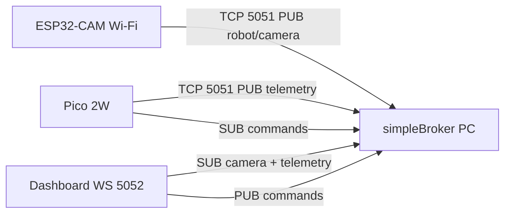

# ESP32-CAM · Cliente simpleBroker (SISEMB)

La **ESP32-CAM** publica vídeo al broker **de forma independiente** de la Pico 2W.

- **Topic:** `robot/camera`
- **Transporte:** TCP `5051` (mismo protocolo JSON-line que la Pico)
- **Formato:** JPEG en base64 (compatible con el dashboard actual)

La Pico sigue con `CAMERA_ENABLED = False` y solo publica `robot/telemetry` + recibe `robot/commands`.

---

## Requisitos

| Componente | Versión / nota |
|------------|----------------|
| Placa | AI-Thinker ESP32-CAM (OV2640) |
| Toolchain | [PlatformIO](https://platformio.org/) (recomendado) o Arduino IDE |
| Red | Misma Wi-Fi que PC broker y Pico (`HONORX8B`, etc.) |
| Broker | `./scripts/start-broker.sh` activo en el PC |

---

## Configuración rápida

```bash
cd esp32cam
cp include/config.example.h include/config.h
# Editar include/config.h: WIFI_SSID, WIFI_PASS, BROKER_HOST
```

| Constante | Descripción |
|-----------|-------------|
| `WIFI_SSID` / `WIFI_PASS` | Red Wi-Fi 2.4 GHz |
| `BROKER_HOST` | IP LAN del PC (`ip -4 addr`, ej. `10.104.69.249`) |
| `BROKER_PORT` | `5051` |
| `BROKER_TOPIC_CAMERA` | `robot/camera` |
| `CAMERA_PUBLISH_INTERVAL_MS` | Intervalo entre frames (default 2000 ms) |

---

## Compilar y subir (PlatformIO)

Desde la raíz del repo:

```bash
./esp32cam/scripts/upload-esp32cam.sh
```

O manualmente:

```bash
cd esp32cam
pio run -t upload
pio device monitor
```

**Cableado programación:** adaptador USB-UART en la ESP32-CAM (GPIO0 a GND al flashear, luego quitar y reset).

---

## Verificación

1. Arranca broker: `./scripts/start_stack.sh`
2. Flashea ESP32-CAM y abre monitor serial (`115200`)
3. Debes ver:
   ```text
   [wifi] OK 10.104.x.x
   [broker] conectado
   [cam] PUB robot/camera 160x120 jpeg=...
   ```
4. Dashboard `http://127.0.0.1:8765/` → panel cámara con imagen
5. Consola broker: `[PUB] robot/camera`

---

## Payload publicado

Compatible con `docs/COMPATIBILITY.md` y `frontend/app.js`:

```json
{
  "action": "PUB",
  "topic": "robot/camera",
  "data": {
    "format": "jpeg",
    "width": 160,
    "height": 120,
    "data": "<base64>",
    "ts": 123456,
    "source": "esp32cam",
    "frame_id": 0
  }
}
```

---

## Arquitectura



---

## Ajuste de calidad / FPS

En `include/config.h`:

```cpp
#define CAMERA_FRAME_SIZE FRAMESIZE_QQVGA   // 160x120
#define CAMERA_JPEG_QUALITY 14              // 0-63, menor = mejor
#define CAMERA_PUBLISH_INTERVAL_MS 2000
```

Para más FPS baja el intervalo; si el broker se satura, sube calidad numérica (peor imagen, menos bytes).

---

## Solución de problemas

| Síntoma | Causa | Acción |
|---------|-------|--------|
| `[wifi] FALLO` | SSID/pass o 5 GHz | Red 2.4 GHz, revisar `config.h` |
| `[broker] connect fallo` | IP/puerto/firewall | `BROKER_HOST`, puerto 5051 abierto |
| Dashboard sin imagen | Broker OFF o topic | Recargar dashboard con broker activo |
| `[camera] init error` | Alimentación | 5 V ≥ 500 mA estable, capacitor 100 µF cerca del módulo |
| Pico y ESP32 compiten | Normal | Ambos pueden publicar; solo ESP32 en `robot/camera` |

---

## Archivos

| Ruta | Rol |
|------|-----|
| `src/main.cpp` | Wi-Fi, cámara, loop publish |
| `src/simple_broker_client.cpp` | Cliente TCP PUB |
| `include/config.example.h` | Plantilla credenciales |
| `include/board_pins.h` | Pines AI-Thinker |
| `platformio.ini` | Entorno PlatformIO |
| `scripts/upload-esp32cam.sh` | Flash desde repo |

Ver también: [docs/PINOUT_PCB.md](../docs/PINOUT_PCB.md), [docs/SETUP_BROKER.md](../docs/SETUP_BROKER.md).
